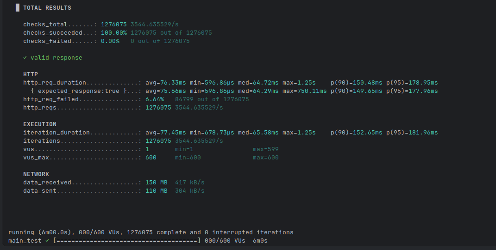

Great — now we’re talking real product scale 👍
Let’s convert your performance numbers into **actual user capacity**.

---

# 🧮 Part 1 — What Does 15k RPS Mean Monthly?

From earlier estimate:

> 1 production node (16 vCPU) ≈ **15,000 RPS peak**

Now we translate that into users.

---

## 📊 Scenario A — URL Redirect Service (1 request per click)

If 1 user = 1 request (link click)

### Per second

15,000 clicks/sec

### Per day

```
15,000 × 60 × 60 × 24
= 1.296 BILLION requests/day
```

That is theoretical peak sustained 24h — not realistic usage pattern.

---

## 📊 Realistic Traffic Pattern

Traffic is NOT flat.

Most systems:

* Peak hour = 5–10× average
* Peak seconds spike even higher

So we calculate using peak-to-average ratio.

---

# 🧠 Part 2 — 0.5M Daily Active Users (500,000 DAU)

Let’s model properly.

Assume:

* 500,000 users/day
* Each user clicks 3 links/day
* Total daily requests = 1.5M requests/day

---

## 📊 Average RPS Needed

```
1,500,000 / (24 × 3600)
≈ 17 RPS average
```

That’s tiny.

---

## 📊 Peak Hour (10× traffic concentration)

Peak RPS ≈ 170 RPS

Even with burst factor (×3):

Peak ≈ 500 RPS

---

# 🎯 Infrastructure Needed for 0.5M DAU

For a redirect-heavy system:

## Minimum Safe Production Setup

### Application Layer

* 2 × 4 vCPU instances
* 8–16 GB RAM each
* Behind load balancer

Why 2?

* High availability
* Rolling deploy
* Failover

Each node can handle 2–3k RPS easily.

You only need ~500 peak RPS.

So you're operating at ~15–20% capacity.

Very safe.

---

### Redis

* 1 primary
* 1 replica
* 4–8 GB RAM
* Managed Redis preferred

---

### DB

* Small instance (2–4 vCPU)
* Since most hits are cached

---

# 💡 Reality Check

Your local test showed:

> 3,500 RPS on 4 cores

0.5M DAU needs:

> < 500 peak RPS

That means:

You are massively over-capable for 0.5M DAU.

---

# 📈 What Would Need 15k RPS?

Let’s reverse calculate.

Assume:

* Each user triggers 5 requests/day
* Peak factor = 10×

To need 15k RPS peak:

You’d need roughly:

> 10–20 million DAU

That’s large-scale platform territory.

---

# 🚀 Final Practical Answer

For **0.5M daily active users**, you need:

### ✔ 2 small app servers (4 vCPU each)

### ✔ Redis primary + replica

### ✔ Small DB

### ✔ Load balancer

And your system will be extremely comfortable.

---

# 🏁 Short Answer

0.5M DAU is very easy for your current architecture.

Even 2–3M DAU would be manageable with moderate scaling.

You are not anywhere near the limits shown by your stress test.


